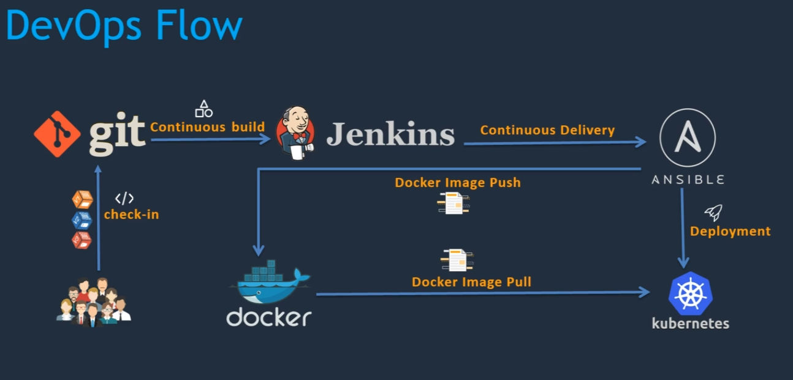

# [simple-devops-hello-world](https://github.com/murshidazher/simple-devops-hello-world)

A simple application to demonstrate ci/cd pipeline with jenkins, ansible, docker, and kubernetes

- `git` - source code management
- `jenkins` - ci/cd pipeline
- `maven` - for build tools
- `ansible` - for configuration management
- `docker` - as a target environment to host the application
- `kubernetes` - to manage the docker containers

## Flow

Once the developer develops a new feature, the source code is pushed to the `git`. The latest source code is then taken by `Jenkins` and build artifacts from it. The artifact should be deployed to a target environment like `docker` or `kubernetes`. We will be using `ansible` as deployment tool to deploy into `docker` or `kubernetes`.

